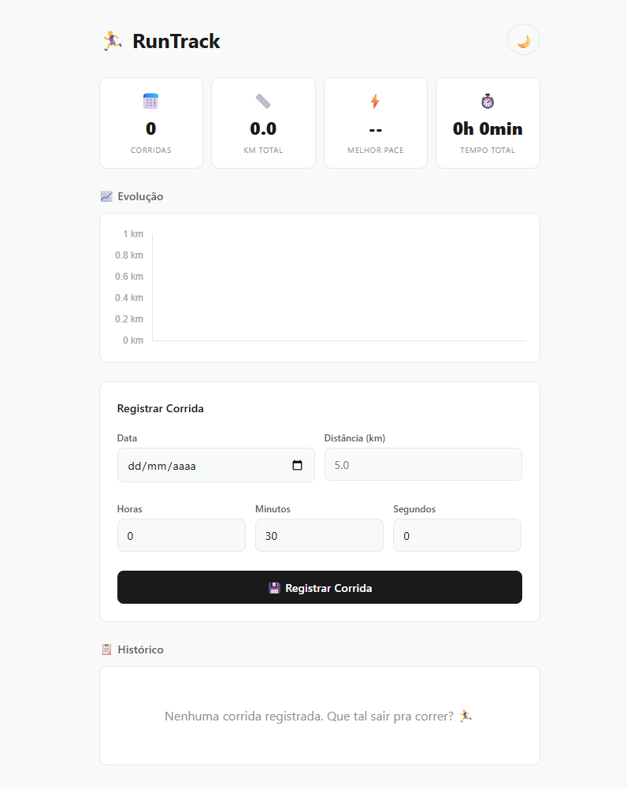
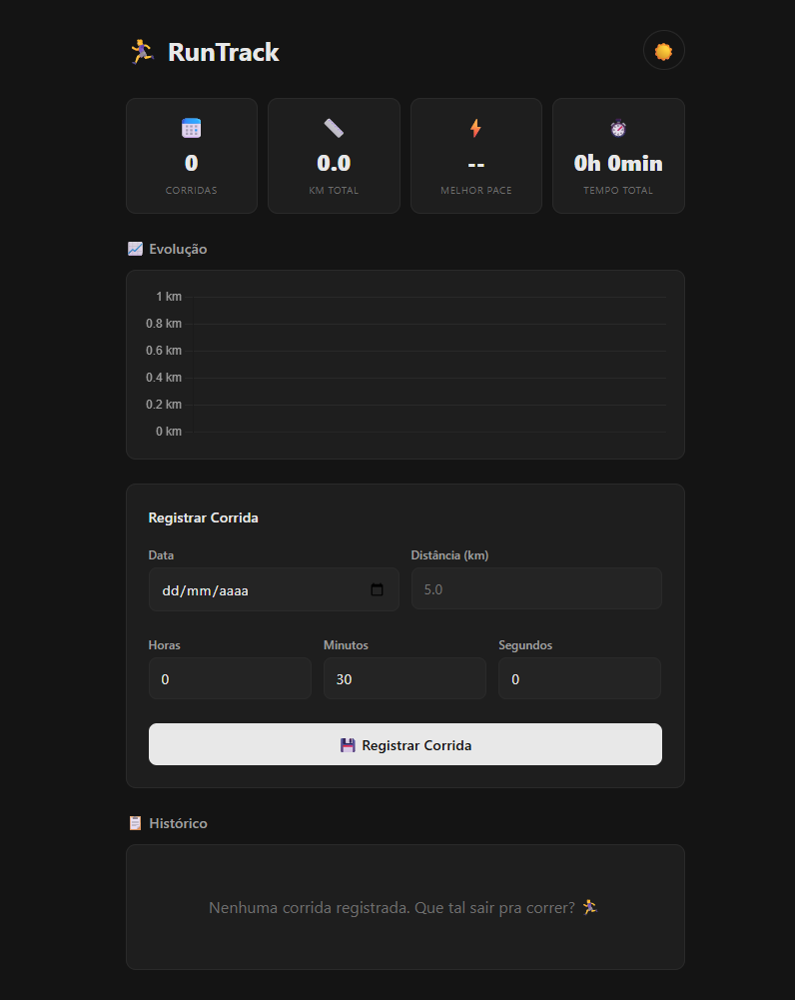

# 🏃‍♀️ RunTrack

App de registro de corridas com cálculo automático de pace e gráfico de evolução. Desenvolvido com HTML, CSS e JavaScript puro.

---

## Funcionalidades:

- Registrar corridas com data, distância e tempo (h, min, s)
- Cálculo automático de pace (min/km)
- Cards de resumo: total de corridas, km acumulado, melhor pace, tempo total
- Gráfico de evolução da distância com Chart.js
- Tema escuro/claro com preferência salva
- Dados salvos no localStorage
- Design responsivo

---

## 🛠️ Tecnologias:

- HTML5
- CSS3 (variáveis, grid, flexbox)
- JavaScript ES6+
- Chart.js
- LocalStorage API

---

## Como rodar?

```bash
git clone https://github.com/alananjos06/app-corrida.git
cd app-corrida
# Abra o index.html no navegador
```

## 📸 Preview
<div align="center"> 
 
</div>

## 👩‍💻 Autora
Feito por Alana Anjos